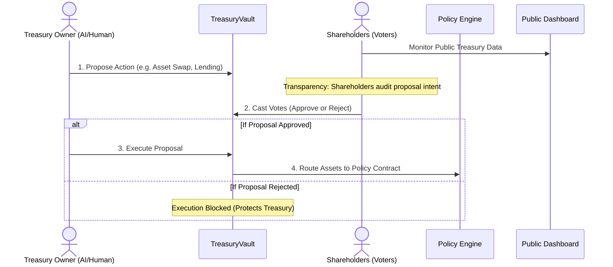

## Smart Treasury

> [!WARNING]
> **Status: Pre-deployment testing**
>
> The core implementation is currently undergoing integration, edge-case, and security testing prior to testnet deployment. The testing phase is focused on validating the interaction between the AI Governor, treasury contracts, treasury asset swaping, on-chain state transitions and security assumptions.

## Overview

An on-chain decentralized treasury designed to transparently manage assets. Deploy a smart treasury and acquire assets with Uniswap Swap protocol, or lend treasury assets for safer activities. 

The treasury's history remains public so the treasury owner cannot falsify performance.

## Motivation

Managing a decentralized treasury is historically slow, lacks usable transparency features, and still keeps stakeholders excluded at times. The moreLikely Smart Treasury solves this by introducing an owner-to-shareholder relationship that helps expose malicious actions with aims of revealing hidden/alternative motives. An autonomous AI governor may be utilized as an treasury owner constrained by smart contracts that automatically reasons, proposes, and executes treasury operations according to a set of predefined goals—it enables true set-and-forget decentralized fund management.

## Key Capabilities

- **Smart Treasury Vaults:** ERC4626-compatible vaults representing proportional ownership via governance tokens.
- **AI-Powered Automonous Management:** An autonomous agent that monitors the market and executes strategies transparently.
- **Policy Engine:** Abstracted policy contracts that restrict malicious owners from stealing treasury funds.
- **Decentralized Oracles:** Native `OracleRouter` integration with Chainlink and Uniswap V3 TWAP for secure asset valuation.
- **Stakeholder Voting:** A robust off-chain to on-chain voting system ensuring the AI Agent operates strictly with shareholder approval.

## Architecture




The architecture is split into three primary layers:

1. **Smart Contracts (On-Chain):** The `TreasuryVault`, `TreasuryToken`, `OracleRouter`, and Policy Contracts deployed on Ethereum/EVM chains.
2. **AI Inference (Off-Chain):** The LLM Agent running on 0G Compute (or centralized fallbacks like Gemini) that analyzes state and constructs transactions.
3. **Execution Layer (Off-Chain to On-Chain):** Powered by Circle Developer-Controlled Wallets to execute trades securely via an `AgentGasEscrow` without exposing private keys.

## Autonomous Workflow

1. **Analysis:** The AI Agent polls the treasury's on-chain holdings and market data via the `OracleRouter`.
2. **Reasoning:** It evaluates this data against the treasury's predefined goals(treasury mandate) and risk constraints (e.g., stop-loss, target allocations).
3. **Proposal:** If a trade is warranted, the AI opens a proposal on the `TreasuryVault` utilizing a specific policy (like `AssetSwapPolicy`).
4. **Execution:** Once a proposal is approved by shareholders, the agent executes the transaction directly on-chain via its Circle-managed wallet.

## Security / trust model

- **No Direct Fund Access:** The treasury's owner has no authority to withdraw or transfer treasury funds directly. Only the what is explictly defined in policy contracts are allow to execute. These transactions stay between the Uniswap protocol and the treasury.
- **Agent Smart Wallet:** The agent's interactions are routed through a sandboxed smart wallet mechanism that strictly enforces rate limits and proposal interactions.
- **Trust Profile Dashboard:** Shareholders can review the exact "reasoning receipts" (JSON schemas) output by the AI via the frontend dashboard to ensure transparency. Also deploy treasury auditing strategies that continuously monitor activity and generate alerts for potential risks or anomalies.

## Testing & validation

Hardhat is used to run isolated unit tests, as well as live fork tests against the Sepolia Testnet.

Current validations include:
- `OracleRouter` accuracy against live Chainlink aggregators and Uniswap V3 pools.
- Live Uniswap SDK calldata execution inside `AssetSwapPolicy`.
- Full end-to-end treasury lifecycle scripts (`setupTestnet.ts`).

## Technology Stack

- **Frontend:** Next.js, React, ethers.js
- **Smart Contracts:** Solidity, Hardhat, OpenZeppelin
- **Oracles:** Chainlink, Uniswap V3
- **AI / Execution:** 0G Compute, Gemini API, Circle Developer-Controlled Wallets

## Repository Structure

- `contracts/`: Core smart contracts (`treasury`, `policy`, `exits`, `interfaces`).
- `frontend/`: The Next.js application dashboard (`src/components/`, `src/app/`).
- `test/`: Hardhat test suites separated by domain (`aquire-assets`, `oracle`, etc.).
- `agent/`: AI agent tools, prompts, and execution scripts.
- `docs/`: Comprehensive architecture and UI documentation.

## Getting Started

## Environment Variables
To run the Smart Treasury locally, create a `.env` file at the root:

```env
# 1. Circle API Credentials (Required for AI Agent Execution)
CIRCLE_API_KEY=""
CIRCLE_ENTITY_SECRET=""
CIRCLE_WALLET_ID=""

# 2. Blockchain Configuration
OWNER_PRIVATE_KEY="" # Required to deploy the contracts initially
SEPOLIA_RPC_URL="https://gateway.tenderly.co/public/sepolia"

# 3. 0G Compute Credentials (Required for AI Inference)
ZEROG_COMPUTE_API_KEY=""
ZEROG_COMPUTE_BASE_URL="https://compute-network-19.integratenetwork.work/v1/proxy"

# 4. Global Oracle Router Address
NEXT_PUBLIC_ORACLE_ROUTER_ADDRESS=""
```

Additionally, if running the frontend, create a `frontend/.env` file:
```env
NEXT_PUBLIC_DEPLOY_NETWORK="testnet"

# 5. NextAuth Configuration (Required for Admin Portal)
# Generate a secret via: openssl rand -base64 32
NEXTAUTH_SECRET="your_nextauth_secret_here"
NEXTAUTH_URL="http://localhost:3000"
# (Optional) Add your preferred OAuth provider here (e.g. Google/GitHub)
# GOOGLE_CLIENT_ID=""
# GOOGLE_CLIENT_SECRET=""
```

## Running Tests
```bash
npm install
npx hardhat test
```

## Pre-Deployment Testing Status / Roadmap
- [x] Core Vault & Governance Contracts
- [x] OracleRouter and Uniswap V3 Integration
- [-] Frontend Treasury Creation & Proposal Dashboards
- [ ] Finalize Smart Wallet Integrations
- [ ] Testnet Deployment
- [ ] Mainnet Deployment

## Design Decisions & Tradeoffs

- **USDC Default:** The platform defaults to USDC as the base asset to integrate seamlessly with the broader Circle ecosystem.
- **Off-Chain AI Computation:** Running AI inference on-chain can be expensive. We allow treasury owners to run their own AI agents on the service provider they prefer. We trade complete decentralization at the compute layer for cost efficiency by computing off-chain and verifying execution natively on-chain via Merkle proofs generated from off-chain shareholder votes.
- **SwapRouter02 vs UniversalRouter:** We opted for `SwapRouter02` and UniswapV3 to maintain compatibility with standard `IERC20.approve`, avoiding the architectural overhaul required for `Permit2`.

## Future work

- Full integration of the `LendingPolicy` (e.g., Aave/Compound). Treasury Policies focused on yield.
- Expansion of the `OracleRouter` to support highly exotic or low-liquidity assets.
- Support for deploying treasuries natively on the Circle Arc Testnet/Mainnet.

## License

MIT License
