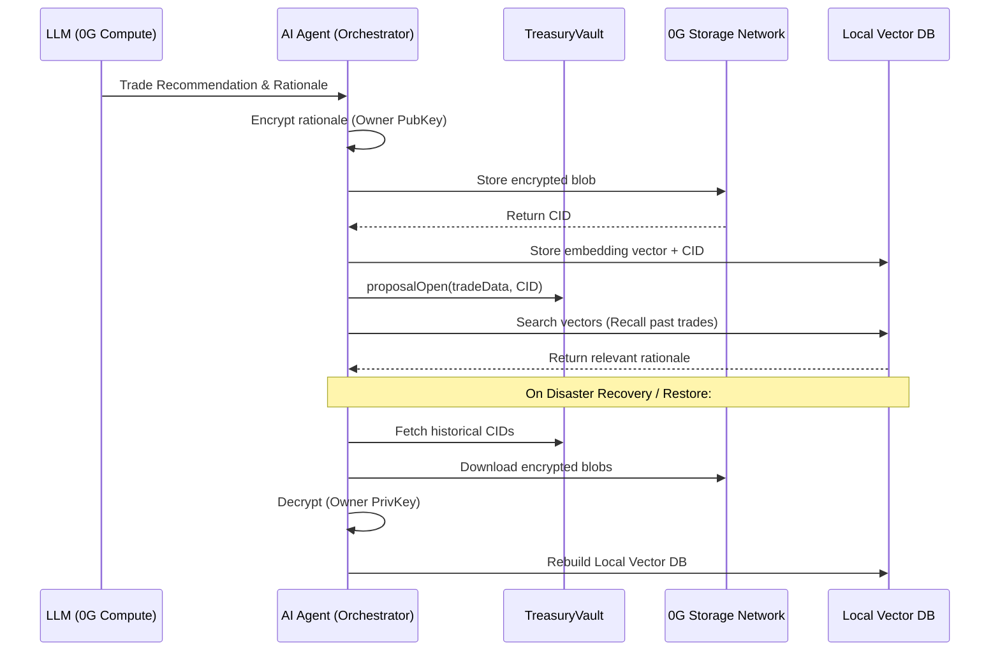

# AI Agent Memory Architecture

This document outlines the localized memory module designed for the AI Governor of an Open Treasury. To prevent catastrophic memory loss and ensure total data sovereignty for the treasury owner, the system utilizes a hybrid Web3 architecture that leverages the **0G Storage Network** for permanent encrypted backup, and a localized Vector Database for lightning-fast semantic search.

## 1. Core Architecture

The architecture separates the heavy, permanent storage from the fast, searchable index. It is highly modular, allowing the 0G Network to act as the permanent "hard drive" while a localized database acts as the active "RAM."



### A. Smart Contract (Ownership & Opt-In)
Memory is strictly opt-in to save costs and preserve privacy.
*   **The Opt-In:** The treasury owner calls an `enableMemory(string publicKey)` function on the `TreasuryVault` or a dedicated `MemoryPolicy`.
*   **Cryptographic Ownership:** Publishing the public key on-chain establishes verifiable ownership. All memory blobs uploaded to the decentralized network must be encrypted using this specific public key.

### B. The AI Agent Orchestrator (Encryption & Upload)
The local Node.js server running the `aiAgent.ts` acts as the orchestrator.
*   When the LLM makes a trade decision, the agent takes the generated memory object (the rationale).
*   The agent encrypts the JSON object locally in memory using the owner's on-chain public key.
*   The agent uploads the encrypted blob to the **0G Storage Network** and receives a Content Identifier (CID).
*   The agent attaches the 0G CID to the on-chain proposal transaction, creating a permanent, verifiable link between the on-chain action and the off-chain reasoning.

### C. The Local Vector Database (Semantic Search)
Decentralized blob storage is not built for fast search.
*   The private server running the AI Agent hosts a lightweight, local Vector Database (e.g., Postgres with `pgvector`, or ChromaDB).
*   The database stores the mathematical vectors (embeddings) of the memory and the corresponding 0G CID. 
*   When the agent evaluates a new trade, it queries the local database to find relevant past decisions via semantic search (RAG - Retrieval-Augmented Generation).

### D. Disaster Recovery (The Restore Function)
If the owner's private server crashes and the local Vector Database is wiped, no data is lost.
*   The agent scans the blockchain for past treasury transactions to extract the 0G CIDs.
*   It downloads the encrypted blobs from the **0G Storage Network**.
*   It decrypts the blobs using the owner's private key and completely rebuilds the local Vector Database from scratch.

---

## 2. Recommended Data Schema

While an agent *could* store raw conversational logs, it is highly recommended to store **structured, highly-condensed summaries** of the rationale and reasoning behind a proposal. 

Raw text consumes excess LLM context window tokens and degrades future reasoning. The memory object SHOULD be formatted specifically to be re-injected into future LLM prompts for quick and effective digestion.

**Example Memory Schema:**
```json
{
  "timestamp": "2026-08-05T12:00:00Z",
  "proposalId": 42,
  "action": "SWAP_USDC_FOR_WETH",
  "marketContext": "WETH dropped 5% in 24h, high volume.",
  "rationaleSummary": "Executed buy-the-dip strategy based on TreasuryGoal max slippage 1%. Expected short-term rebound.",
  "outcome": "PENDING" // Can be updated to PROFIT/LOSS in a later memory blob
}
```

By storing highly structured rationale summaries, the agent can efficiently query its localized Vector DB, pull the top 3 most relevant historical trades, and inject them into its active prompt without overwhelming the context limit.
