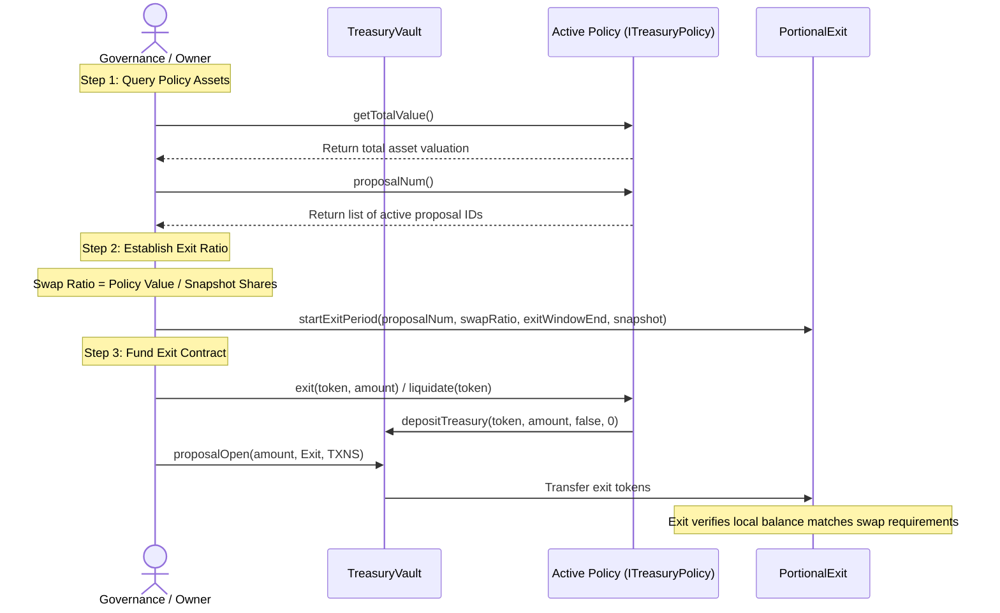

# Open Treasury: Portional Exit Specification and Policy Requirements

This document defines the verification requirements, state validations, and contract integration rules for the `PortionalExit.sol` (Type 2C Exit Policy) contract. Rather than describing external trade routing, this specification focuses on how the exit contract validates shareholder claims and how it queries active policies using the standard `ITreasuryPolicy` interface to ensure transparent accounting.

---

## 1. Reusable Session-Based Design

Unlike one-off exit contracts that must be redeployed for every exit proposal, `PortionalExit.sol` is designed to be fully **reusable** over the treasury's lifetime:
*   **Initialization**: The constructor (`init`) only registers the immutable `treasuryVault` address and the `owner` address.
*   **Rounds Management**: The owner initiates a new exit period by calling `startExitPeriod(...)` with parameters for the new round.
*   **State Reset**: The contract increments a `currentRound` variable, saving the parameters in an `ExitPeriod` struct and snapshotting eligible shareholder balances under `eligibleShares[currentRound][voter]`. This avoids gas-heavy loops to clear old mapping data.

---

## 2. Shareholder Claim Validations (`PortionalExit.sol`)

Before executing any distribution of underlying vault assets, `PortionalExit` enforces strict cryptographic and state checks during the `claimExit(uint256 amount)` transaction to prevent front-running and double-claiming:

### A. Snapshot Eligibility Checks
To prevent users from buying shares *after* an exit proposal has been announced and immediately exiting to arbitrage strategy assets, eligibility is restricted to a construction-time snapshot of shareholders:
```solidity
require(amount <= eligibleShares[round][msg.sender], "Exceeds eligible balance");
eligibleShares[round][msg.sender] -= amount;
```
*   **Verification**: The contract checks the caller's balance against the `eligibleShares` mapping snapshot captured when the current exit period was initiated.
*   **Double-Claim Protection**: The caller's eligible balance for the current round is decremented immediately upon claim.

### B. Time Window Verification
Exits must occur within the governance-allocated window. If a time constraint is set, the contract verifies the current block time:
```solidity
if (period.exitWindowEnd != 0) {
    require(block.timestamp <= period.exitWindowEnd, "Exit window has ended");
}
```

### C. Pro-rata Valuation & Sufficiency
The amount of exit assets dispensed is calculated using the governance-approved `swapRatio` for the current round (relative to `1e18` precision):
```solidity
uint256 exitAmount = (amount * period.swapRatio) / 1e18;
require(exitAmount > 0, "Exit amount is zero");
require(exitToken.balanceOf(address(this)) >= exitAmount, "Insufficient exit tokens");
```
*   **Verification**: The exit contract verifies that its own local balance of the `exitToken` is sufficient to cover the claim before executing the transfer.

### D. Safe Share Burning
To maintain treasury token parity, the exit contract pulls the user's `treasToken` shares and locks them forever in the `0xdead` address, reducing the active share pool:
```solidity
treasToken.safeTransferFrom(msg.sender, address(0xdead), amount);
```

---

## 3. Policy Integration & Attribute Queries (`ITreasuryPolicy`)

When setting up or verifying a portional exit, governance tools and the `PortionalExit` contract rely on the standard `ITreasuryPolicy` interface implemented by active strategies (such as `AssetSwapPolicy.sol`). This interface exposes the vital metrics required to calculate the `swapRatio` and audit the strategy's status:

```solidity
interface ITreasuryPolicy is IERC165 {
    function status() external view returns (uint256);
    function treasuryVault() external view returns (address);
    function proposalNum() external view returns (uint256[] memory);
    function getTotalValue() external view returns (uint256);
    function liquidate(address token) external;
    function liquidated() external view returns (LiquidationRecord[] memory);
}
```

### A. Calculating `swapRatio` via `getTotalValue()`
Before a new exit round is initiated, governance must calculate the fair exchange rate of strategy assets to vault shares.
*   **Query**: Governance queries `getTotalValue()` on the target policy contract.
*   **Logic**: `getTotalValue()` aggregates the live valuation of all held assets using registered oracle markets.
*   **Verification**: The total value is divided by the snapshot's outstanding eligible shares to establish the `swapRatio` passed to `startExitPeriod(...)`.

### B. Verifying Liquidation State via `status()`
To ensure that strategy assets have been securely returned to the vault before the exit contract is funded, the setup process queries policy status:
*   **Verification**: The policy's `status()` must return `1` (Liquidated) if the entire policy is being wound down, or the `liquidated()` history queue must contain the latest liquidation cycle timestamp and snapshot amount.
*   **Impact**: Ensures that active trading has ceased and capital has been safely escrowed back to the vault before shareholders can claim.

### C. Auditing Proposal Bounds via `proposalNum()`
Because policies can manage funds received from multiple historical proposals:
*   **Verification**: `proposalNum()` returns an array of all proposal IDs that funded the target policy.
*   **Audit**: Governance uses this list to verify that the portional exit snapshot accounts for all shareholders who participated in the matching funding rounds.

---

## 4. High-Level Integration Flow

The interaction below outlines the verification check points between the Vault, Policy, and the `PortionalExit` contract:


