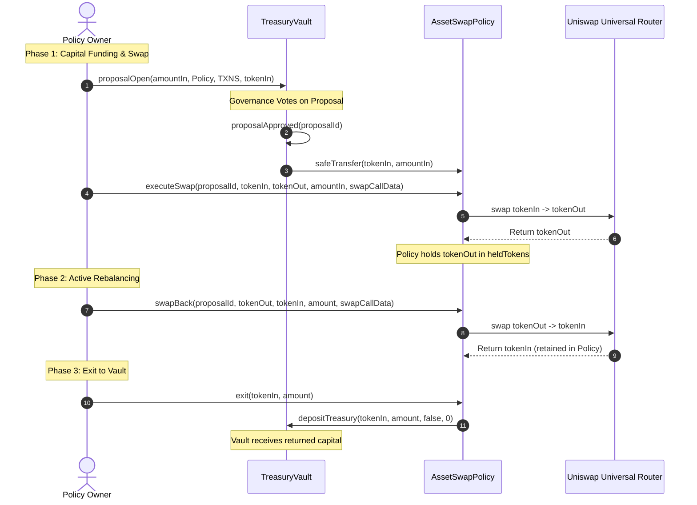

# Open Treasury: Asset Acquisition Policy Specification

This document details the technical implementation and transaction workflows of the `AssetSwapPolicy.sol` contract. This module is responsible for executing token swaps on Uniswap (V3 / Universal Router) using governance-approved capital from the `TreasuryVault`, holding the acquired assets as a managed strategy, and handling swap-backs, exits, and liquidations.

---

## 1. Core Integration Functions

### `executeSwap(...)`
This is the primary entry point for executing swaps to acquire assets. It is called by the owner once a swap proposal has passed.

```solidity
function executeSwap(
    uint256 proposalId,
    address tokenIn,
    address tokenOut,
    uint256 amountIn,
    bytes calldata swapCallData
) external onlyOwner returns (bool)
```

#### Key Technical Operations inside `executeSwap`:
1.  **Verification:** Validates that the proposal has not already been executed, and that the policy contract has sufficient `tokenIn` balance.
2.  **Approve Router:** Grants allowance to the Uniswap `universalRouter` to spend `amountIn` of `tokenIn`.
3.  **Low-Level Swapping:** Executes the swap call using pre-computed `swapCallData`. 
4.  **Holding Strategy:** The contract records `tokenOut` in the `heldTokens` array if it is not already tracked. The swapped assets remain held in the policy contract rather than being returned to the vault immediately.
5.  **State Audit:** Stores the proposal ID in the `proposalIds` array and updates the standard `proposalNum` state variable to reflect the latest active proposal.

---

### `swapBack(...)`
Swaps a held asset back to another token (usually the original deposited token) and retains the swapped output in the policy contract for future use.

```solidity
function swapBack(
    uint256 proposalId,
    address tokenIn,
    address tokenOut,
    uint256 amountIn,
    bytes calldata swapCallData
) external onlyOwner returns (uint256 amountOut)
```
- **Tracking**: Pushes a new `SwapBackRecord` to `swapBackHistory`.

---

### `exit(...)`
Withdraws a specified amount of a token back to the `TreasuryVault`. This is not bound to a specific proposal and represents normal capital return.

```solidity
function exit(
    address token,
    uint256 amount
) external onlyOwner
```
- **Implementation**: Calls `ITreasuryVault(treasuryVault).depositTreasury(token, amount, false, 0)` directly and type-safely.
- **Tracking**: Pushes an `ExitRecord` to `exitHistory`.

---

### `liquidate()`
Wind-down trigger conforming to the standard `ITreasuryPolicy` interface.

```solidity
function liquidate() external override onlyOwner
```
- **Action**: Sets policy `status = 1` (Liquidated) and snapshots the current valuation in `liquidationHistory`.

---

### `liquidateToken(...)`
Allows manual token-by-token withdrawal of assets back to the vault during liquidation. This design avoids gas-heavy `for` loops.

```solidity
function liquidateToken(
    address token
) external onlyOwner
```
- **Constraint**: Only callable after `liquidate()` has been triggered (status == 1).
- **Implementation**: Sweeps the entire balance of the token back to the vault as-is.

---

## 2. Activity View Functions

Indexers, frontends, and auditors can query history and state via these view functions:
- **`getSwapBackHistory()`**: Returns all rebalancing and swap-back records.
- **`getExitHistory()`**: Returns all exit transfers to the vault.
- **`getLiquidationHistory()`**: Returns records of all liquidation events.
- **`getProposalIds()`**: Returns the array of all proposal IDs that funded the policy.
- **`getTotalValue()`**: Calculates the live USD value of all `heldTokens` using the `OracleRouter`.
- **`status()`**: Returns `0` (Active) or `1` (Liquidated).

---

## 3. Transaction Flow Diagram

The sequence below illustrates how swaps are executed and how exits or liquidations are handled:


