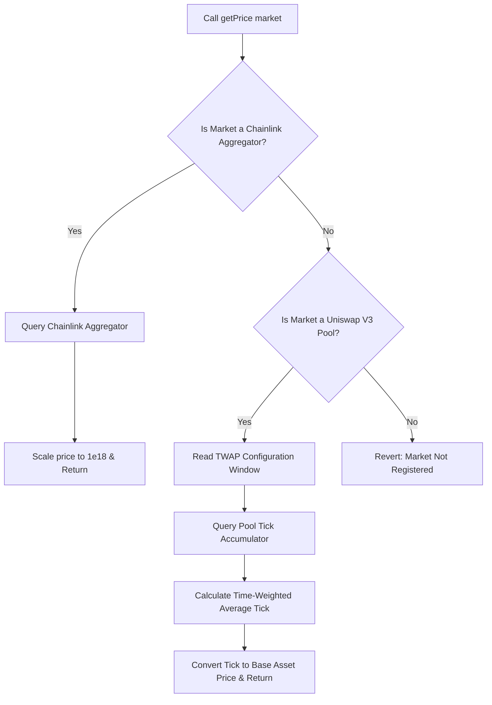

# Open Treasury: Price Oracle Specification

This document outlines the architectural workflows for the `OracleRouter.sol` module. The Oracle Router serves as the unified pricing engine by policy contracts.

## 1. Core Principles

*   **Market-Keyed Architecture :** The Oracle Router is a shared global contract. To prevent multiple vaults from overwriting each other's configurations, the router registry is keyed by the **Market Contract Address** (the specific Uniswap V3 Pool address or Chainlink Aggregator address) instead of the token address.
*   **Direct Asset Denomination (No USD Requirement):** Prices are returned in the denomination of the registered market. 
    *   If Owner A registers the `WETH/WBTC` pool, the price of WETH is returned in `WBTC` terms.
    *   If Owner B registers the `WETH/USDC` pool, the price of WETH is returned in `USDC` terms.
    *   This eliminates redundant conversions, saves gas, and allows any treasury to support arbitrary base assets natively.
*   **Scale Standard:** All returned values are scaled to `1e18` (18 decimals) to ensure compatibility with standard ERC-20 decimal math.
*   **Registry Reuse:** When registering a market, the router checks if it is already registered. If so, it reuses the existing configuration to save gas.

---

## 2. Price Feed Integration Types

The `OracleRouter` supports two distinct pricing sources:

### 2.1 Chainlink Price Feeds (Standard)
*   The owner registers the token's specific Chainlink Aggregator contract address.
*   The router queries `latestRoundData()` and dynamically scales the returned value (typically 8 decimals) to the required 18 decimals based on the token's configured decimals.

### 2.2 Uniswap V3 TWAP Feeds (Long-Tail / Niche Assets)
*   The owner registers the specific Uniswap V3 pool address.
*   To prevent flash-loan spot price manipulation, the router queries the **Time-Weighted Average Price (TWAP)** over a configurable window.
*   **TWAP Configuration:** The time window (in seconds) used to calculate the average price is configured per pool (e.g. 1800 seconds for 30 minutes, or 3600 seconds for 1 hour). A longer window increases resistance to manipulation, while a shorter window updates faster.
*   **Constraint:** The registered Uniswap pool must pair the collateral token with the Treasury's base asset (e.g. `COLLATERAL/BASE_ASSET`).

---

## 3. Workflow & Routing Logic

When `getPrice(address market)` is called, the router evaluates the registered market address type:



---

## 4. Smart Contract Interface

Every compliant price oracle module must implement the `IPriceOracle` interface:

```solidity
// SPDX-License-Identifier: MIT
pragma solidity ^0.8.20;

interface IPriceOracle {
    /**
     * @dev Returns the price of a token from a registered market.
     * @param market The address of the registered Uniswap Pool or Chainlink Aggregator.
     * @return price The price scaled to 1e18.
     */
    function getPrice(address market) external view returns (uint256);
}
```
