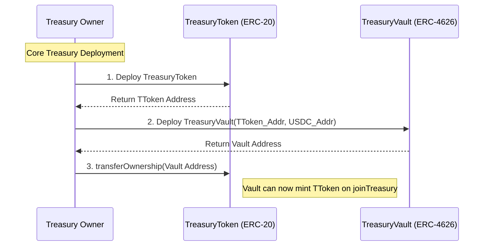

# Treasury Smart Contract Architecture

## Overview

This document describes the architecture for the `TreasuryVault.sol`, `TreasuryToken.sol` and `TreasuryVoting.sol`, which follows the [Open Treasury](https://github.com/jimstir/open-treasury) specification.

### Core Principles

- **Treasury Init:** The initalzation values for the treasury when deployed by an `owner`.
- **Proposals:** Proposals by the owner, or authorized user or shareholders if allowed, about actions need to conduct a vote related to the treasury.
- **Voting:** 
- **Executing Approvals:** If approved, execute any onchain transaction required. 
- **Joining a Treasury:**
- **Exiting a Treasury:**
-**Policy:**
- **Treasury Audit:** Display values, and activities of a treasury, that is public access through on-chain view functions, hash recreation, treasury-mandate, etc.

### Treasury Init

#### Approved Deposit Token

- Each treasury must have at least one approved deposit token defined after deployment. This value is contract address saved at `IERC20 _deToken`.
- This value is set by the owner at the time of deploy, 
- An defined approved token can not be removed.
- The owner can request to add new token with `ProposalType` enum value `ADD_TOKEN`.

#### Deploy Sequenence

1. Deploy the TreasuryToken Contract: This is the base ERC-20 token that represents overarching voting power in the DAO. It must be deployed first because the Vault requires its address upon initialization.
2. Deploy the TreasuryVault: During construction, it takes the address of the newly deployed TreasuryToken (to use as its ERC-4626 base asset) and the address of the first allowed deposit token (e.g., USDC). Once deployed, the Vault must be granted minting privileges on the TreasuryToken by the owner. The vault should be the only owner of the TreasuryToken.

### Proposals

Proposals act as the critical security boundary between the Treasury Manager (Human or AI) and the Vault's underlying assets.

#### Authorized Proposers

Proposals cannot be opened arbitrarily by random users or all stakeholders. The `proposalOpen()` function implements an auth modifier. Only the `owner`, the original deployer of the treasury and authorized addresses defined by the `owner` are allowed to initiate proposals.

The primary `ProposalType` include:

`TXNs`: A request to withdraw a specific amount of the base asset to a verified Policy Contract (e.g., executing a Uniswap trade or depositing into Aave).
`CLOSE`: An emergency or strategic request to recall liquidity from an active Policy Contract back into the idle TreasuryVault pool.
`ADD_TOKEN`: A governance-level request to add a new stablecoin or fiat-equivalent to the whitelist of accepted deposit tokens. (Note: This protects shareholders by ensuring the mathematical base of the treasury cannot change without consensus).

#### Open Proposal

When an authorized actor successfully calls proposalOpen(), the following deterministic lifecycle begins:

Instantiation: The smart contract generates a new incremental `proposalNum`.
State Storage: The parameters (target receiver, token type, requested amount, and voting threshold style) are stored securely in the proposalBook struct.
Event Emission: A `proposalO` (Proposal Opened) event is emitted to the blockchain. A trigger for the frontend UI and indexers to alert shareholders that a new vote is active.
Lock: The requested tokens remain safely inside the TreasuryVault until the shareholder consensus threshold is met and `proposalApproved()` is successfully called.

#### Close Proposal

The `proposalClose()` function marks the definitive end of a proposal's lifecycle. The `owner` or authorized address should create proposals with a defined close process. The standard recommended proces is to close proposals only after a failed voting period (votes on the treasury do not have a time limit), or after the token that were sent were returned(this may include with profit/loss).

If shareholders wish to exit an open proposal, but the owner/auth has not a closed a proposal, a shareholder can call the `proposalOpen()` with a `ProposalType.CLOSE` to start voting to close a proposal, without the owner.

#### Add Token

### Voting

### Exiting Proposals

EXIT (Shareholder Redemption): A `owner` can introduce an `Proposal.EXIT` ProposalType is specifically reserved for unlocking shareholder liquidity.
Modular Exit Policies
Because different treasuries require different exit mechanics (e.g., continuous "rage-quitting", quarterly liquidity windows, or full DAO dissolution), the exit logic is handled entirely by external Exit Policy smart contracts.

Deployment: An Exit Policy is typically deployed alongside the TreasuryVault to provide transparent, pre-defined exit rules for early joiners.
Execution: When an EXIT proposal is passed, the Vault routes the approved funds to the designated Exit Policy contract.
Redemption: The Exit Policy handles the complex logic of accepting a user's TreasuryToken, burning it to remove their voting power, and dispensing their pro-rata share of the underlying asset.