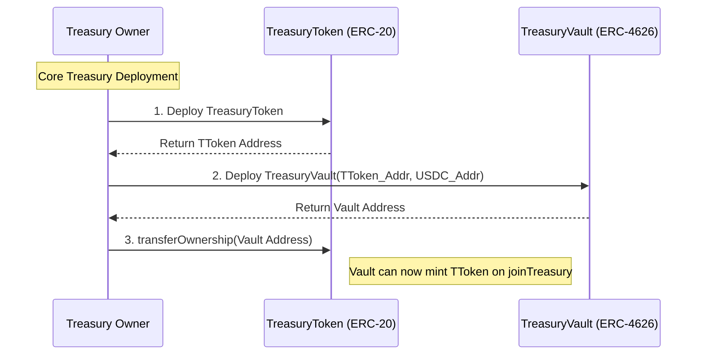

# Treasury Smart Contract Architecture

## Overview

This document describes the architecture for the `TreasuryVault.sol`, `TreasuryToken.sol` and `TreasuryVoting.sol`, which follows the [Open Treasury](https://github.com/jimstir/open-treasury) specification.

### Core Principles

- **Treasury Init:** The initalzation values for the treasury when deployed by an `owner`.
- **Proposals:** Proposals by the owner, or authorized user or shareholders if allowed, about actions need to conduct a vote related to the treasury.
- **Voting:** 
- **Executing Approvals:** If approved, execute any onchain transaction required. 
- **Joining a Treasury:**
- **Exiting a Treasury:** 
-**Policy:** A compliant policy contract
- **Treasury Audit:** Display values, and activities of a treasury, that is public access through on-chain view functions, hash recreation, treasury-mandate, etc.


### Treasury Init

#### Approved Deposit Token

- Each treasury must have at least one approved deposit token defined after deployment. This value is contract address saved at `IERC20 _deToken`.
- This value is set by the owner at the time of deploy, 
- An defined approved token can not be removed.
- The owner can request to add new token with `ProposalType` enum value `ADD_TOKEN`.

#### Deploy Sequenence

1. Deploy the TreasuryToken Contract: This is the base ERC-20 token that represents overarching voting power in the DAO. It must be deployed first because the Vault requires its address upon initialization.
2. Deploy the TreasuryVault: During construction, it takes the address of the newly deployed TreasuryToken (to use as its ERC-4626 base asset) and the address of the first allowed deposit token (e.g., USDC). Once deployed, the Vault must be granted minting privileges on the TreasuryToken by the owner. The vault should be the only owner of the TreasuryToken.



### Proposals

Proposals act as the critical security boundary between the Treasury Manager (Human or AI) and the Vault's underlying assets.

#### Authorized Proposers

Proposals cannot be opened arbitrarily by random users or all stakeholders. The `proposalOpen()` function implements an auth modifier. Only the `owner`, the original deployer of the treasury and authorized addresses defined by the `owner` are allowed to initiate proposals.

The primary `ProposalType` include:

`TXNs`: A request to withdraw a specific amount of the base asset to a verified Policy Contract (e.g., executing a Uniswap trade or depositing into Aave).
`CLOSE`: An emergency or strategic request to recall liquidity from an active Policy Contract back into the idle TreasuryVault pool.
`ADD_TOKEN`: A governance-level request to add a new stablecoin or fiat-equivalent to the whitelist of accepted deposit tokens. (Note: This protects shareholders by ensuring the mathematical base of the treasury cannot change without consensus).
`EXIT_TOKEN`

#### Open Proposal

When an authorized actor successfully calls proposalOpen(), the following deterministic lifecycle begins:

Instantiation: The smart contract generates a new incremental `proposalNum`.
State Storage: The parameters (target receiver, token type, requested amount, and voting threshold style) are stored securely in the proposalBook struct.
Event Emission: A `proposalO` (Proposal Opened) event is emitted to the blockchain. A trigger for the frontend UI and indexers to alert shareholders that a new vote is active.
Lock: The requested tokens remain safely inside the TreasuryVault until the shareholder consensus threshold is met and `proposalApproved()` is successfully called.

It is RECOMMENDED that the defined `receiver` of the `proposalOpen` should pass a `checkCompliance(address policyAddress)`.
The complaint policy interface is defined in the [Policy](#policy) section.

#### Close Proposal

The `proposalClose()` function marks the definitive end of a proposal's lifecycle. The `owner` or authorized address should create proposals with a defined close process. The standard recommended proces is to close proposals only after a failed voting period (votes on the treasury do not have a time limit), or after the token that were sent were returned(this may include with profit/loss).

If shareholders wish to exit an open proposal, but the owner/auth has not a closed a proposal, a shareholder can call the `proposalOpen()` with a `ProposalType.CLOSE` to start voting to close a proposal, without the owner.

#### Add Token

-`ProposalType.ADD_TOKEN`: 

### Voting

Voting consensus mechanism is where shareholders vote lock their `treasuryToken` directly into a proposal. This creates an on-chain verification layer before any funds can be moved.

- To vote on a proposal, a shareholder must lock their `treasuryToken` using `proposalDeposit()` or `proposalMint()`.
- By locking tokens, shareholders physically back the proposal with their own capital.
- Staked voting tokens cannot be retrieved until the proposal is officially closed the `proposalClose()`. Shareholders can then retrieve their stake tokens via `proposalWithdraw()` or `proposalRedeem()`, to discourage double-voting attacks in the treasury.

#### Checking a Vote

- When `vote(proposalNum)` is called, the `treasuryVault` determines if the proposal has passed based on the vote boolean defined in the proposal book

Value-Ratio Voting (rate == true):

- Logic: The total voting shares locked in the proposal must be greater than or equal to the requested withdraw amount: totalShares(proposal) >= withdrawAmount.
- Use Case: Typically used for asset trades (TXNS). A manager cannot deploy $100,000 USDC into a policy unless shareholders lock at least $100,000 of their own DAO tokens to back the risk.

#### Off-Chain Voting & Voter Pool (Optional)

To maximize voter participation and eliminate gas costs for shareholders, the protocol implements a gasless off-chain voting system aggregated through an optional (`VoterPool.sol`). This design replaces standard relayers with a Layer-2 style Merkle rollup model to solve block gas limits and front-running vulnerabilities.

1. The Deposit Phase

Shareholders who want to vote gaslessly deposit their `TreasuryToken` into the `VoterPool` contract. The pool tracks their deposits internally(may revert if address not a member?***). By locking tokens inside the pool first, voters cannot transfer their tokens away to front-run and crash the relayer's transaction (resolving the Gas Exhaustion/Griefing exploit).

2. The Off-Chain Signature & Aggregation Phase

*   **Free Signatures:** Shareholders sign their vote allocations for a specific proposal off-chain using EIP-712 signatures.
-   **Merkle Tree Generation:** The platform operator (or AI Governor) collects these signed votes off-chain and constructs a Merkle Tree where each leaf represents a user's vote: `(voter_address, amount, proposalId)`.
-  **Constant Gas Execution:** The operator submits a single transaction containing the Merkle Root and the Total Sum of all votes to the `VoterPool` contract. The `VoterPool` verifies the signatures and executes one depsoit of the total sum into the `TreasuryVault` on behalf of the pool. 
    *   *Gas Optimization:* This reduces the Vault's on-chain cost from an $O(N)$ loop of individual deposits to a flat $O(1)$ single deposit, making it scale easily to thousands of voters without hitting the Block Gas Limit.

3. The Trustless Egress Phase (Merkle Claim)

When the proposal is closed, the Vault returns the assets to the `VoterPool` contract. To withdraw their tokens, individual users pay their own gas to submit a Merkle Proof matching the stored root. The `VoterPool` contract verifies the proof and transfers their original shares (that are not in an opened proposal) back to their wallet.

4. Optional Service Monetization
Because the platform operator pays the gas to submit the aggregated votes, the `VoterPool` is implemented as an optional premium service. The operator can charge a small service fee (e.g., in basis points on withdrawal or performance fee on yield) to cover operational gas costs and monetize the voting convenience. Direct on-chain voting remains free (except for standard network gas) and accessible directly through the `TreasuryVault`.

#### Governance Security, Reasoning Token Locking

Unlike traditional DAOs that use checkpointed voting (which allows voters to support infinite concurrent proposals without locking tokens), the Open Treasury utilizes a Capital-Locked Voting Model. This is a deliberate game-theoretic design choice implemented to protect minority shareholders:

Rate-Limiting Whales: Because tokens must be physically locked to vote, voting power is a scarce resource. Large token holders (whales) cannot collude with the owner to push through multiple malicious proposals simultaneously, as they are forced to divide their voting weight across active proposals.
Preventing Voter Fatigue: By making voting resource-heavy, the protocol discourages "proposal spamming." Shareholders are incentivized to deeply analyze and prioritize only the most critical proposals.
Economic Alignment (Skin in the Game): Locking capital directly ties the voter's financial outcome to the proposal's success. Voters cannot vote "Yes" on a risky proposal and immediately dump their tokens on the open market before the proposal executes.

(note: Future work could intorduce different voting options.)

### Join a Treasury

An `onwer` deploying a new treasury SHOULD keep all `approveTokens` of the same asset type(denomination). If not, the token ratio distributed will be mathmatically incorrect allow funds to be taken by later depositors. The platform will openly display the `approvedTokens` of each treasury. Also the trust profile will warn users that the token demonimation do not match and will not recommend users to join.

This is left to the responsiblity of the `owner`, as it will not restrict treasuries to rely on one USD stablecoin, or retrict future treasury innovations where to ratio is purposly manipulated.

### Policy

A policy is defined as a contract address on the `proposalBook.withdraw` in the `proposalOpen` function.

A Policy is a smart contract that manages the token owned by the treasury. To maintain transparent, auditable tracking, every policy SHOULD be a Compliant Policy that implements the ITreasuryPolicy interface:

```solidity

    /**
     * @dev Returns the address of the TreasuryVault this policy belongs to.
     */
    function treasuryVault() external view returns (address);
    /**
     * @dev Returns the specific proposal number this policy is executing.
     */
    function proposalNum() external view returns (uint256);
    /**
     * @dev Calculates and returns the total Net Asset Value (NAV) of the policy,
     * including accrued yields, denominated in the Vault's underlying asset (e.g., USDC).
     */
    function getTotalValue() external view returns (uint256);
    /**
     * @dev Initiates the wind-down and liquidation process for this policy.
     * The policy must withdraw/sell its assets and return the underlying funds 
     * to the TreasuryVault using `depositTreasury()`.
     */
    function liquidate() external;
```


### Exit a Treasury

EXIT (Shareholder Redemption): A `owner` can introduce an `ProposalType.EXIT` ProposalType is specifically reserved for unlocking shareholder liquidity.

The moreLikely platform will expose a few types of exit policies and deployment methods.

#### Exit Policy Types

The `EXIT` policies are different from the `TXNS` policies. The `EXIT` policies SHOULD be pre-defined contracts that have the exact functions as the exit interface. This will expose the entire exit contract to the treasury contract, not allowing an owner to create new exit rules.

(Future: new Exit Interfaces could be introduced to the community and agreed on, but a new treasury contract MUST be deployed to integrate the new interface in the contract. So at treasury deployment a exit contract MAY not be deployed, but the interface is supported.)

Because different treasuries require different exit mechanics (e.g., continuous "rage-quitting", quarterly liquidity windows, or full DAO dissolution), the exit logic is handled entirely by external Exit Policy smart contracts. Below are the types deployable current for moreLikely, as defined in the [Open Treasury spec]():

- `Type 2A`: Immutable, no exit policy is deployed at the time of treasury contract deployment. The contract still supports exit interface but the `owner` does not intend any `treasuryToken` swap.

- Dissolution Exit - `Type 2B` or `Type 2D`: When an owner wants to stop the treasury activities, the owner can triggger a dissolution exit. The owner must close all open policies and return the funds back to the treasury.

If an `owner` abandons its treasury responsibilities and shareholder become aware fo the situation. Share holders can trigger a dissolution exit policy by first creating close proposal request for every open proposal,then returning funds back to the treasury.

For both situations, the dissolution exit policy MUST require all open proposals are closed, and withdrawn(if appliciable).

- Portional Exit - `Type 2C` : Liquidate a specific strategy/portion of tokens and distribute it only to the shareholders who were active at the time of the exit proposal.

We must prevent people from depositing USDC after the exit is announced to exploit the exit pool (front-running).

#### Exit Policy Deployment

An Exit Policy is typically deployed alongside the TreasuryVault to provide transparent, pre-defined exit rules for early joiners.
Execution: When an EXIT proposal is passed, the Vault routes the approved funds to the designated Exit Policy contract.
Redemption: The Exit Policy handles the complex logic of accepting a user's TreasuryToken, burning it to remove their voting power, and dispensing their pro-rata share of the underlying asset.

Exit interface:
``` solidity
interface IExitPolicy is IERC165 {
    function treasuryVault() external view returns (address); // the address of the treasury
    function proposalNum() external view returns (uint256); // the proposalNumber of this Exit(upgradeable depending on exit deployment)
    function swapRatio() external view returns (uint256); // the agreed treasuryToken swap
    function exitWindowEnd() external view returns (uint256); 
    function claimExit(uint256 amount) external;
}

```

## Auditing a Treasury

An Open Treasury is designed to be fully transparent and auditable by any party (shareholders, indexers, or AI agents) directly from the blockchain. This transparency acts as a trust framework, allowing users to verify the treasury's state and detect malicious actions without relying on a centralized front-end interface.

### Audit Getters

The following view functions are implemented in `TreasuryVault.sol` to expose the contract's state for public auditing.

#### 1. Administration & Access Control
*   `whosOwner() public view returns (address)`
    *   **Auditing Purpose:** Identifies the deployer/owner of the treasury. Users can verify that this address does not hold minting rights on the `TreasuryToken` itself to prevent unilateral share manipulation.
*   `getAuth(address user) public view returns (bool)`
    *   **Auditing Purpose:** Exposes whether a given address has secondary administrative privileges. Auditors can use this to verify the specific addresses of relayers, AI agents, or escrows that have proposal execution access.

#### 2. Whitelists & Assets
*   `approvedTokens(IERC20 token) public view returns (bool)`
    *   **Auditing Purpose:** Verifies if a token is whitelisted for deposits. Essential for ensuring the owner has not unilaterally whitelisted a malicious/illiquid token to manipulate the treasury's asset base.
*   `tokensL() public view returns (IERC20[] memory)`
    *   **Auditing Purpose:** Returns the full array of all whitelisted deposit tokens, allowing indexers to easily track every active asset class in the treasury.

#### 3. Proposal Tracking
*   `proposalCheck() public view returns (uint256)`
    *   **Auditing Purpose:** Returns the total count of all opened proposals. This serves as the index length for auditing the proposal database.
*   `closedProposal(uint256 proposal) public view returns (bool)`
    *   **Auditing Purpose:** Confirms if a specific proposal is finalized. A closed proposal indicates that its active lifecycle has ended and shareholders can safely withdraw/redeem their locked voting shares.
*   `executed(uint256 proposal) public view returns (bool)`
    *   **Auditing Purpose:** Verifies if the approved tokens for a `TXNS` proposal have been transferred out to the target policy contract.

#### 4. Financial & Risk Auditing
*   `owed(uint256 num) public view returns (uint256)`
    *   **Auditing Purpose:** The primary risk tracking function. It calculates the deficit of an active proposal (`withdraw - deposits`). If the value is `0` or negative, the policy has returned all principal (with potential profits). If positive, this is the exact amount of treasury capital currently at risk in that policy.
*   `totalShares(uint256 proposal) public view returns (uint256)`
    *   **Auditing Purpose:** Exposes the exact amount of voting shares locked in a proposal. This allows public calculation of shareholder voter turnout.

#### 5. Logic & Compliance Verification
*   `vote(uint256 proposal) public view returns (bool)`
    *   **Auditing Purpose:** Publicly calculates if a proposal has met its required consensus threshold (either Value-Ratio or Supermajority) to ensure execution rules are mathematically enforced.
*   `checkCompliance(address policyAddress) public view returns (bool)`
    *   **Auditing Purpose:** Queries the ERC-165 compliance of any smart contract. Shareholders can check this view function to ensure a target address is a Compliant Policy *before* voting to send funds to it.
