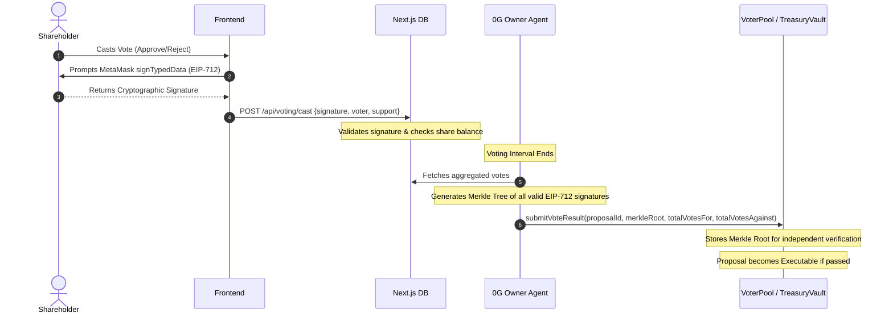

# Technical Design Document (TDD)

## Project: moreLikely Smart Treasury

This document specifies the technical architecture, database schemas, API contracts, and smart contract interfaces for the moreLikely Smart Treasury application.

---

## 1. Database Schemas (Prisma)

```prisma
datasource db {
  provider = "postgresql" // or "sqlite" for local development
  url      = env("DATABASE_URL")
}

generator client {
  provider = "prisma-client-js"
}

model Wallet {
  id              String           @id @default(uuid())
  address         String           @unique // Lowercase EVM wallet address
  role            String           @default("none") // 'owner', 'stakeholder', or 'none'
  createdAt       DateTime         @default(now())
  updatedAt       DateTime         @updatedAt
  votes           Vote[]
  disputes        Dispute[]
}

model Treasury {
  id              String           @id @default(uuid())
  address         String           @unique // Smart contract address of TreasuryVault
  name            String
  baseAsset       String           // Target base asset (e.g., 'USDC', 'ETH')
  tokenAddress    String           @unique // Address of TreasuryToken ERC20
  ownerAddress    String           // Current owner EOA address (can be operator or AI agent EOA)
  createdAt       DateTime         @default(now())
  updatedAt       DateTime         @updatedAt
  goals           TreasuryGoals?
  proposals       Proposal[]
}

model TreasuryGoals {
  id                    String   @id @default(uuid())
  treasuryId            String   @unique
  treasury              Treasury @relation(fields: [treasuryId], references: [id], onDelete: Cascade)
  mandate               String?  @default("No specific mandate provided.") // Shareholder goals for AI to evaluate against
  privateOverrides      Json?    // e.g. { "assetSwap": "Custom override prompt" }
  slippageLimit         Float    @default(0.5) // e.g. 0.5%
  stopLoss              Float    @default(5.0) // e.g. 5.0%
  maxTreasuryPercentage Float    @default(10.0) // max size of a single trade (e.g. 10.0%)
  targetAllocations     Json     // e.g. { "WETH": 40.0, "WBTC": 40.0, "USDC": 20.0 }
  dataSources           String   @default("") // Comma-separated list of approved web/news feeds
  disputePeriodSeconds  Int      @default(86400) // Default 24 hours review delay
  updatedAt             DateTime @updatedAt
}

model Proposal {
  id              String           @id @default(uuid())
  onChainId       Int              // The ID mapping to proposalBook[num] on-chain
  treasuryId      String
  treasury        Treasury         @relation(fields: [treasuryId], references: [id], onDelete: Cascade)
  proposerAddress String           // Who opened the proposal
  recipientAddress String          // Recipient EOA or AssetSwapPolicy contract address
  withdrawAmount  Float            // Amount of assets to withdraw for the trade
  targetToken     String           // Address of target token to buy
  votingMode      String           // 'value-ratio' or 'supply-based'
  status          String           @default("pending") // 'pending', 'approved', 'executed', 'closed', 'disputed'
  createdAt       DateTime         @default(now())
  updatedAt       DateTime         @updatedAt
  decisionReport  DecisionReport?
  votes           Vote[]
  disputes        Dispute[]
}

model DecisionReport {
  id              String   @id @default(uuid())
  proposalId      String   @unique
  proposal        Proposal @relation(fields: [proposalId], references: [id], onDelete: Cascade)
  rationale       String   // LLM reasoning for the trade
  timeframe       String   // e.g. 'short-term', 'long-term'
  swapRoutes      Json     // Uniswap swap path and pricing
  rawMarketData   Json     // Uniswap pool liquidity, prices, holder statistics
  ticketReceipt   String?  // Verifiable execution ticket receipt from 0G AI Network
  createdAt       DateTime @default(now())
}

model Vote {
  id              String   @id @default(uuid())
  proposalId      String
  proposal        Proposal @relation(fields: [proposalId], references: [id], onDelete: Cascade)
  voterId         String
  voter           Wallet   @relation(fields: [voterId], references: [id], onDelete: Cascade)
  shares          Float    // Voting power (weight of TreasuryToken at proposal block)
  support         Boolean  // true = Approve, false = Reject/Veto
  signature       String   // Cryptographic EIP-712 signature proving vote authenticity
  timestamp       DateTime @default(now())

  @@unique([proposalId, voterId])
}

model Dispute {
  id              String   @id @default(uuid())
  proposalId      String
  proposal        Proposal @relation(fields: [proposalId], references: [id], onDelete: Cascade)
  disputerId      String
  disputer        Wallet   @relation(fields: [disputerId], references: [id], onDelete: Cascade)
  reason          String   // Description of violation
  evidence        String   // Context / Audit data
  txHash          String   @unique // Transaction hash of on-chain pause trigger
  reviewPeriodEnd DateTime // Time when the pause window expires
  resolved        Boolean  @default(false)
  createdAt       DateTime @default(now())
}

model PlatformConfig {
  id                String   @id @default(uuid())
  cronIntervalMs    Int      @default(3600000)
  maxConcurrentJobs Int      @default(10)
  isPaused          Boolean  @default(false)
  updatedAt         DateTime @updatedAt
}
```

---

## 2. Technical Mechanisms

### A. Off-Chain Voting & On-Chain Merkle Proofs
To avoid high gas fees for shareholders casting votes, the application implements off-chain voting secured by on-chain Merkle proof verification.



1. **EIP-712 Signature**: The voting message is structured:
   - `domain`: `{ name: "SmartTreasuryVoting", version: "1", chainId: X, verifyingContract: Address }`
   - `types`: `{ Vote: [{ name: "proposalId", type: "uint256" }, { name: "support", type: "bool" }, { name: "voter", type: "address" }] }`
2. **Aggregated Merkle Proofs**:
   - The frontend database stores all valid EIP-712 signatures.
   - When the voting window closes, a Merkle Tree is constructed off-chain where each leaf is a cryptographic hash of a valid shareholder vote.
   - The resulting Merkle Root is submitted to the smart contract along with the final vote tallies. 
   - The smart contract natively enforces execution conditions, and anyone can independently cryptographically verify a vote was counted by generating a proof against the on-chain Merkle Root, completely removing the need for a centralized "Agent Attestation".

### B. Audit disputes & Verification (0G Platform)
- The AI Agent runs inside a verifiable execution environment on **0G**. When it invokes the LLM (Gemini or OpenAI), it records the prompt inputs, model parameters, and raw output.
- It signs these logs to generate a **0G Ticket Receipt**.
- The `AuditInteractionsWidget` displays these tickets. If the inputs in the ticket do not match live market data, or if the agent acted outside the parameters defined by `TreasuryGoals`, stakeholders can flag it.
- **On-Chain Pause**: If a dispute is reported, a stakeholder can call `triggerDispute(proposalId)` on the `AssetSwapPolicy.sol` contract. This is a public function that requires the caller to hold a minimum percentage of `TreasuryToken` shares (e.g. >1%). Calling it flags the proposal as `disputed` on-chain and pauses execution for a set cooldown period (`disputePeriodSeconds`).

### C. Treasury Document Architecture (Mandates & Prompts)
To ensure transparency and modularity, treasury rules and AI instructions (like the Treasury Mandate, Trust Profile prompts, and Policy prompts) are stored as standard Markdown (`.md`) files containing embedded JSON key-value pairs, rather than standard database strings. 

1. **Default Templates & Generation:** 
   Files are strictly generated (meaning the platform's default template is copied and explicitly tied to an entity) conditionally:
   - `treasury-mandate.md`: Generated when the `TreasuryVault` contract is deployed.
   - `trust-profile-prompt.md`: Generated only when a user deploys an AI Governor to conduct trust profile tasks (e.g., as a subscriber on the 0G network).
   - Policy Prompts (`asset-swap-prompt.md`): Generated only when the specific policy contract is deployed on-chain.
2. **Dual-Mode Storage:**
   - **Mode A (Platform DB MVP):** Files are stored on standard cloud storage. The database tracks the file URI, a SHA-256 hash, and a timestamp. 
   - **Mode B (0G Network):** If the user utilizes the 0G network, they submit the generated file directly to 0G Storage using their own balance. The platform database only stores the 0G Content Identifier.
3. **Cryptographic Signatures (Off-Chain Integrity):**
   To prevent "he-said-she-said" scenarios without incurring on-chain gas costs, every file version is hashed (SHA-256) and cryptographically signed (EIP-712). Default templates are signed by the Platform Admin Wallet. Any user/owner edits are signed by the editor's wallet. Users can download the `.md` file, hash it locally, and verify the signature to ensure authenticity.
4. **The "Private Override" State:**
   There is no separate "private override" file. Every `.md` file begins as a public default. If the Treasury Owner edits a file (e.g., adding a secret trading parameter to the Swap Policy prompt) and chooses to hide those edits from shareholders, that specific file enters a **Private Override** state. The database pointer tracks this visibility.
6. **UI Editing & Validation (MVP):**
   To maximize simplicity for users, the frontend displays the `.md` files inside a standard HTML `<textarea>`. Users can read the JSON configuration blocks at the top and type their plain-text updates in the "Owner Justifications" section at the bottom without needing to learn Markdown.
   - **Save & Validation:** When the user clicks "Save", the backend runs a strict `JSON.parse()` extraction on the JSON code blocks (e.g., `targetAllocations`, `slippageLimit`) before accepting the file. If a non-technical user accidentally deleted a bracket `}`, the backend rejects the save and returns a formatting error to the UI.
   - **Signature Execution:** If the `JSON.parse` passes, the frontend prompts the user's wallet to EIP-712 sign the new file hash. The backend then saves the updated file (and signature) as a Private Override or Public Edit based on the user's toggle.

---

## 3. API Contracts

### `POST /api/voting/cast`
- **Triggered by:** `VotingInterface`
- **Description:** Submits a stakeholder's off-chain EIP-712 signed vote.
- **Request Body:**
  ```json
  {
    "proposalId": "string",
    "voterAddress": "string",
    "support": boolean,
    "signature": "string"
  }
  ```
- **Response:** `{ "success": true, "votesCounted": float }`

### `POST /api/governor/evaluate`
- **Triggered by:** Cron worker or manual dashboard trigger.
- **Description:** Runs the autonomous decision loop on the 0G host. Performs market analysis, checks risk rules against `TreasuryGoals`, compiles LLM inputs, generates the Decision Report, and opens/closes proposals.
- **Response:**
  ```json
  {
    "action": "propose_swap | execute_swap | close_proposal | idle",
    "proposalId": 123,
    "rationale": "Liquidity is deep and price dropped 5%, aligning with allocation strategy.",
    "txHash": "string"
  }
  ```

### `POST /api/audit/report`
- **Triggered by:** `AuditInteractionsWidget` (Submit Dispute Form)
- **Description:** Logs a malicious decision dispute, submits the evidence, and updates proposal status.
- **Request Body:**
  ```json
  {
    "proposalId": "string",
    "disputerAddress": "string",
    "reason": "string",
    "evidence": "string",
    "txHash": "string" // Hash of the on-chain dispute trigger transaction
  }
  ```
- **Response:** `{ "success": true, "pausedUntil": "ISO-Timestamp" }`

---

## 4. Uniswap Swapping API Integration

The `AssetSwapPolicy.sol` contract delegates execution to the Uniswap Universal Router. The transaction payload is generated off-chain via the Uniswap Swapping API and verified on-chain.

### API Swap Flow
1. **Get Quote**: The AI Agent queries the Uniswap trade gateway to find the best route:
   ```http
   GET https://trade-api.gateway.uniswap.org/v1/quote?tokenIn=0x...&tokenOut=0x...&amount=1000000&type=exactIn&slippage=0.5
   ```
2. **Build Swap Transaction**: The AI Agent posts the returned quote to get the transaction payload:
   ```http
   POST https://trade-api.gateway.uniswap.org/v1/swap
   Headers: { "x-api-key": "YOUR_API_KEY", "Content-Type": "application/json" }
   Body: { "quote": { ...quoteObject }, "simulateTransaction": true }
   ```
3. **Execution Broadcast**: The response contains `{ "transaction": { "to": "0xRouter...", "data": "0xCalldata...", "value": "0" } }`. The agent submits this `data` bytes payload directly to the `AssetSwapPolicy.sol` contract.

---

## 5. Smart Contract Interfaces

### `AssetSwapPolicy.sol`
```solidity
interface IAssetSwapPolicy {
    event SwapExecuted(uint256 indexed proposalId, address indexed tokenIn, address indexed tokenOut, uint256 amountIn, uint256 amountOut);
    event ProposalDisputed(uint256 indexed proposalId, address indexed disputer, uint256 reviewPeriodEnd);

    // Verifies AI attestation, checks voting thresholds, parses swapCallData, and executes swap on Uniswap
    function proposalApproved(
        uint256 proposalId, 
        uint256 totalVotesFor, 
        uint256 totalVotesAgainst, 
        bytes calldata attestationSignature,
        bytes calldata swapCallData // Calldata returned by Uniswap POST /swap endpoint
    ) external returns (bool);

    // Public function for shareholders (>1% shares) to lock a proposal during a dispute
    function triggerDispute(uint256 proposalId) external;
    
    // Checks if proposal is paused/disputed
    function isPaused(uint256 proposalId) external view returns (bool);
}
```

---

## 6. AI Governor Wallet Architecture (Transaction Forwarder)

To optimize key management and maximize security, the AI Governor utilizes a **Transaction Forwarder** smart wallet pattern (`AgentGasEscrow.sol`). The platform backend manages a single Master Platform Wallet via the **Circle Developer-Controlled Wallets API (App Kits)** to submit transactions via Multi-Party Computation (MPC) for all agents, while the `AgentGasEscrow` holds the individual treasury's gas budget and enforces security policies on-chain.

### Wallet Implementation Flow
1. **Deployment & Authorization:** The treasury owner deploys the `AgentGasEscrow` contract and funds it with ETH. The `AgentGasEscrow` is then registered as an authorized user (`_authUsers`) on the `TreasuryVault`.
2. **Relaying:** When the AI decides to execute an action, the Master Platform Wallet (via Circle API) submits the transaction directly to the `AgentGasEscrow` and pays the initial Ethereum network gas fee.
3. **Execution & Refund:** The `AgentGasEscrow` validates the request, forwards the call to the `TreasuryVault`, and finally refunds the exact gas cost back to the Master Platform Wallet from the owner's deposited ETH balance.

### Requirements for a Transfer (Smart Wallet Rules)
Before the `AgentGasEscrow` will forward a transaction to the `TreasuryVault` or `AssetSwapPolicy` and refund gas, it MUST verify the following rules on-chain:
- **Caller Verification:** The `msg.sender` calling the escrow MUST be the designated Circle Master Platform Wallet address.
- **Proposal Gas (Rate Limiting):** If the forward request is to open a new proposal (`proposalOpen`), the escrow MUST check its internal timestamp to enforce a rate limit (e.g., minimum 24 hours since the last proposal opened).
- **Execution Gas (State Validation):** If the forward request is to execute a trade (`executeSwap` / `proposalApproved`), the escrow MUST query the `TreasuryVault` to verify that `TreasuryVault.vote(proposalId) == true` (the proposal passed) and that it has not already been executed.
- **Gas Limit Cap:** The escrow SHOULD enforce a maximum gas price or gas limit per transaction to prevent the Master Platform Wallet from maliciously or accidentally draining the escrow via inflated gas fees.

## 8. Treasury Value Tracking Mechanism (TVL)

Because the moreLikely Smart Treasury executes actions via modular policies rather than direct monolithic trades, the treasury's total value is not simply the ERC20 balance of the `TreasuryVault` contract. To properly display metrics on the treasury cards and governor dashboard, the platform tracks both direct and indirect asset values.

### The "Join Treasury" Proposal (Proposal 0)
The very first conceptual "proposal" for any treasury is the **Join Treasury** proposal, internally tracked as Proposal `0` (`userBook[msg.sender][0]`). 
- When users deposit the base asset (e.g. USDC) without allocating it to a specific active swap proposal, the liquidity enters this default pool. 
- The total value of Proposal `0` represents the unallocated, direct base asset liquidity of the treasury. This metric is prominently displayed on the treasury dashboard.

To exit the treasury and redeem TreasuryToken shares for the base asset (e.g., USDC), the protocol relies on Liquidity Unlock Proposals:

The Proposal: The treasury owner or a quorum of shareholders can submit a formal LiquidityUnlockProposal detailing the total amount of base asset to be made available for redemption.
Liquidating Assets: Upon approval, the AI Governor (or manual owner) is mandated to gracefully close active positions and pull the required funds back from the Policy contracts to the main TreasuryVault.
The Redemption Window: Once the target liquidity is secured in the vault, a time-bound "Withdrawal Window" (e.g., 72 hours) opens. During this window, the redeem() and withdraw() functions are temporarily unlocked, allowing shareholders to burn their shares and exit the treasury safely.

#### Proposal Type Enum

The TreasuryVault smart contract supports a few ProposalType Enum value to allow different proposals request besides transactions.

- pType = ADD_TOKEN. Upon achieving quorum in vote()

### Indirect Value Tracking (Active Policies)
When a proposal is approved by shareholders and executed by the AI Agent, the specified assets are transferred *out* of the `TreasuryVault` and *into* an isolated execution contract, such as the `AssetSwapPolicy` or a Lending Policy.
- **Indirect Ownership:** The treasury no longer owns these tokens directly in the vault. Instead, it owns them indirectly based on the active policy contract temporarily holding them for execution.
- **Tracking Mechanism:** To calculate the true Total Value Locked (TVL) and display accurate treasury activities, the backend indexer maintains a registry of all approved proposals and their corresponding policy contract addresses. The TVL mechanism aggregates:
  1. **Direct Value:** The base assets held directly in the `TreasuryVault` (including Proposal 0).
  2. **Active Swap Value:** The target assets currently held in active `AssetSwapPolicy` contracts awaiting swap execution, or the swapped assets waiting to be refunded back to the vault.
  3. **Active Yield Value:** Any yield-bearing tokens or collateral held in active lending/staking policy contracts.

This composite TVL is continuously tracked and cached by the backend to ensure the UI displays an accurate, real-time representation of the treasury's net worth across all its active on-chain positions.

---

## 7. Frontend UI Requirements

### Treasury Dashboard & Navigation
- **Clickable Cards:** Treasury widget cards displayed on the `/dashboard` page MUST be clickable, navigating the user to the Treasury Detail Page (`/governor`).
- **URL Parameter Passing:** The navigation link must pass the treasury's unique identifier via URL parameters (e.g., `/governor?id=<uuid>`).

### Treasury Detail Page & Share Functionality
- **Unique Link Construction:** The Governor Detail Page must construct a shareable link using the `id` from the URL parameters combined with the application's base domain.
- **Domain Configuration:** The base domain MUST be configured as a placeholder in the `package.json` under the `config.domain` property (e.g., `"config": { "domain": "https://morelikely-treasury.com" }`). This allows easy customization of the environment domain.
- **Share Button:** A "Share Link" button MUST be displayed on the page. Clicking this button copies the fully constructed, unique URL (e.g., `https://morelikely-treasury.com/governor?id=<uuid>`) to the user's clipboard for easy sharing.

---

## 9. Platform Scheduler & Admin Architecture

The moreLikely platform supports automated background execution of AI agents for its active subscribers. This is managed by the **Platform Scheduler** and monitored via the **Admin Dashboard**.

### A. The Platform Scheduler Daemon
The Scheduler (`agent/scheduler.ts`) is a persistent Node.js loop that automatically triggers the AI Orchestrator for platform-managed treasuries.
1. **Filtering by Deployment Type:** The scheduler queries the database and strictly filters for `providerType === "gemini"`. Decentralized 0G network deployers and private self-hosted nodes are explicitly ignored by the platform loop (they must run their own cron jobs).
2. **Dynamic Database Limits:** Instead of static `.env` variables, the scheduler reads its configuration (`cronIntervalMs`, `maxConcurrentJobs`, `isPaused`) from the `PlatformConfig` database table at the start of every cycle. This allows administrators to throttle or pause the entire platform in real-time without rebooting servers.
3. **Subscription Enforcer:** Before executing a job, the scheduler instantiates the Orchestrator to check the user's on-chain `SubscriptionManager` NFT. If the NFT is transferred or expired, the scheduler immediately aborts the job to protect platform resources.

### B. Admin Dashboard (Web2 SSO Authentication)
A dedicated Next.js route at `/admin` (accessible via `https://morelikely-treasury.com/admin`) provides a real-time command center to monitor the scheduler and active treasuries.
- **Authentication Model (Web2 SSO):** To maximize portability and security, the Admin UI is protected by standard Web2 Single Sign-On (e.g., NextAuth with Google OAuth) combined with Role-Based Access Control (RBAC), rather than relying on a Web3 EOA wallet connection. This ensures admins can securely access emergency controls from mobile devices or alternate computers without needing hardware wallets.
- **Emergency Kill Switch:** The UI provides a master toggle mapped to the `isPaused` flag in the database, allowing an authenticated admin to instantly halt all automated LLM inferences across the platform.
- **Open Source Security:** The Admin UI implementation is fully open-source. Security is strictly enforced by the backend API validation and the OAuth middleware, avoiding "security through obscurity" practices.
