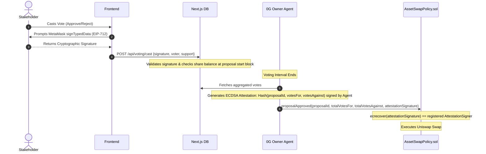

# Technical Design Document (TDD)

## Project: moreLikely Smart Treasury

This document specifies the technical architecture, database schemas, API contracts, and smart contract interfaces for the moreLikely Smart Treasury application.

---

## 1. Database Schemas (Prisma)

```prisma
datasource db {
  provider = "postgresql" // or "sqlite" for local development
  url      = env("DATABASE_URL")
}

generator client {
  provider = "prisma-client-js"
}

model Wallet {
  id              String           @id @default(uuid())
  address         String           @unique // Lowercase EVM wallet address
  role            String           @default("none") // 'owner', 'stakeholder', or 'none'
  createdAt       DateTime         @default(now())
  updatedAt       DateTime         @updatedAt
  votes           Vote[]
  disputes        Dispute[]
}

model Treasury {
  id              String           @id @default(uuid())
  address         String           @unique // Smart contract address of TreasuryVault
  name            String
  baseAsset       String           // Target base asset (e.g., 'USDC', 'ETH')
  tokenAddress    String           @unique // Address of TreasuryToken ERC20
  ownerAddress    String           // Current owner EOA address (can be operator or AI agent EOA)
  createdAt       DateTime         @default(now())
  updatedAt       DateTime         @updatedAt
  goals           TreasuryGoals?
  proposals       Proposal[]
}

model TreasuryGoals {
  id                    String   @id @default(uuid())
  treasuryId            String   @unique
  treasury              Treasury @relation(fields: [treasuryId], references: [id], onDelete: Cascade)
  slippageLimit         Float    @default(0.5) // e.g. 0.5%
  stopLoss              Float    @default(5.0) // e.g. 5.0%
  maxTreasuryPercentage Float    @default(10.0) // max size of a single trade (e.g. 10.0%)
  targetAllocations     Json     // e.g. { "WETH": 40.0, "WBTC": 40.0, "USDC": 20.0 }
  dataSources           String   @default("") // Comma-separated list of approved web/news feeds
  disputePeriodSeconds  Int      @default(86400) // Default 24 hours review delay
  updatedAt             DateTime @updatedAt
}

model Proposal {
  id              String           @id @default(uuid())
  onChainId       Int              // The ID mapping to proposalBook[num] on-chain
  treasuryId      String
  treasury        Treasury         @relation(fields: [treasuryId], references: [id], onDelete: Cascade)
  proposerAddress String           // Who opened the proposal
  recipientAddress String          // Recipient EOA or AssetSwapPolicy contract address
  withdrawAmount  Float            // Amount of assets to withdraw for the trade
  targetToken     String           // Address of target token to buy
  votingMode      String           // 'value-ratio' or 'supply-based'
  status          String           @default("pending") // 'pending', 'approved', 'executed', 'closed', 'disputed'
  createdAt       DateTime         @default(now())
  updatedAt       DateTime         @updatedAt
  decisionReport  DecisionReport?
  votes           Vote[]
  disputes        Dispute[]
}

model DecisionReport {
  id              String   @id @default(uuid())
  proposalId      String   @unique
  proposal        Proposal @relation(fields: [proposalId], references: [id], onDelete: Cascade)
  rationale       String   // LLM reasoning for the trade
  timeframe       String   // e.g. 'short-term', 'long-term'
  swapRoutes      Json     // Uniswap swap path and pricing
  rawMarketData   Json     // Uniswap pool liquidity, prices, holder statistics
  ticketReceipt   String?  // Verifiable execution ticket receipt from 0G AI Network
  createdAt       DateTime @default(now())
}

model Vote {
  id              String   @id @default(uuid())
  proposalId      String
  proposal        Proposal @relation(fields: [proposalId], references: [id], onDelete: Cascade)
  voterId         String
  voter           Wallet   @relation(fields: [voterId], references: [id], onDelete: Cascade)
  shares          Float    // Voting power (weight of TreasuryToken at proposal block)
  support         Boolean  // true = Approve, false = Reject/Veto
  signature       String   // Cryptographic EIP-712 signature proving vote authenticity
  timestamp       DateTime @default(now())

  @@unique([proposalId, voterId])
}

model Dispute {
  id              String   @id @default(uuid())
  proposalId      String
  proposal        Proposal @relation(fields: [proposalId], references: [id], onDelete: Cascade)
  disputerId      String
  disputer        Wallet   @relation(fields: [disputerId], references: [id], onDelete: Cascade)
  reason          String   // Description of violation
  evidence        String   // Context / Audit data
  txHash          String   @unique // Transaction hash of on-chain pause trigger
  reviewPeriodEnd DateTime // Time when the pause window expires
  resolved        Boolean  @default(false)
  createdAt       DateTime @default(now())
}
```

---

## 2. Technical Mechanisms

### A. Off-Chain Voting & On-Chain Attestation
To avoid high gas fees for stakeholders casting votes, the application implements off-chain voting with on-chain cryptographic attestation.



1. **EIP-712 Signature**: The voting message is structured:
   - `domain`: `{ name: "SmartTreasuryVoting", version: "1", chainId: X, verifyingContract: Address }`
   - `types`: `{ Vote: [{ name: "proposalId", type: "uint256" }, { name: "support", type: "bool" }, { name: "voter", type: "address" }] }`
2. **Aggregated Attestation**:
   - The AI Owner Agent acts as the authorized validator (its EOA address is registered as `attestationSigner` in `AssetSwapPolicy.sol`).
   - When the voting window closes, the agent signs the outcome payload: `keccak256(abi.encodePacked(proposalId, totalVotesFor, totalVotesAgainst, passed))`.
   - The transaction submitted to the contract passes these parameters along with the signature. The contract executes `ecrecover` to confirm the authenticity of the attestation before executing the swap.

### B. Audit disputes & Verification (0G Platform)
- The AI Agent runs inside a verifiable execution environment on **0G**. When it invokes the LLM (Gemini or OpenAI), it records the prompt inputs, model parameters, and raw output.
- It signs these logs to generate a **0G Ticket Receipt**.
- The `AuditInteractionsWidget` displays these tickets. If the inputs in the ticket do not match live market data, or if the agent acted outside the parameters defined by `TreasuryGoals`, stakeholders can flag it.
- **On-Chain Pause**: If a dispute is reported, a stakeholder can call `triggerDispute(proposalId)` on the `AssetSwapPolicy.sol` contract. This is a public function that requires the caller to hold a minimum percentage of `TreasuryToken` shares (e.g. >1%). Calling it flags the proposal as `disputed` on-chain and pauses execution for a set cooldown period (`disputePeriodSeconds`).

---

## 3. API Contracts

### `POST /api/voting/cast`
- **Triggered by:** `VotingInterface`
- **Description:** Submits a stakeholder's off-chain EIP-712 signed vote.
- **Request Body:**
  ```json
  {
    "proposalId": "string",
    "voterAddress": "string",
    "support": boolean,
    "signature": "string"
  }
  ```
- **Response:** `{ "success": true, "votesCounted": float }`

### `POST /api/governor/evaluate`
- **Triggered by:** Cron worker or manual dashboard trigger.
- **Description:** Runs the autonomous decision loop on the 0G host. Performs market analysis, checks risk rules against `TreasuryGoals`, compiles LLM inputs, generates the Decision Report, and opens/closes proposals.
- **Response:**
  ```json
  {
    "action": "propose_swap | execute_swap | close_proposal | idle",
    "proposalId": 123,
    "rationale": "Liquidity is deep and price dropped 5%, aligning with allocation strategy.",
    "txHash": "string"
  }
  ```

### `POST /api/audit/report`
- **Triggered by:** `AuditInteractionsWidget` (Submit Dispute Form)
- **Description:** Logs a malicious decision dispute, submits the evidence, and updates proposal status.
- **Request Body:**
  ```json
  {
    "proposalId": "string",
    "disputerAddress": "string",
    "reason": "string",
    "evidence": "string",
    "txHash": "string" // Hash of the on-chain dispute trigger transaction
  }
  ```
- **Response:** `{ "success": true, "pausedUntil": "ISO-Timestamp" }`

---

## 4. Uniswap Swapping API Integration

The `AssetSwapPolicy.sol` contract delegates execution to the Uniswap Universal Router. The transaction payload is generated off-chain via the Uniswap Swapping API and verified on-chain.

### API Swap Flow
1. **Get Quote**: The AI Agent queries the Uniswap trade gateway to find the best route:
   ```http
   GET https://trade-api.gateway.uniswap.org/v1/quote?tokenIn=0x...&tokenOut=0x...&amount=1000000&type=exactIn&slippage=0.5
   ```
2. **Build Swap Transaction**: The AI Agent posts the returned quote to get the transaction payload:
   ```http
   POST https://trade-api.gateway.uniswap.org/v1/swap
   Headers: { "x-api-key": "YOUR_API_KEY", "Content-Type": "application/json" }
   Body: { "quote": { ...quoteObject }, "simulateTransaction": true }
   ```
3. **Execution Broadcast**: The response contains `{ "transaction": { "to": "0xRouter...", "data": "0xCalldata...", "value": "0" } }`. The agent submits this `data` bytes payload directly to the `AssetSwapPolicy.sol` contract.

---

## 5. Smart Contract Interfaces

### `AssetSwapPolicy.sol`
```solidity
interface IAssetSwapPolicy {
    event SwapExecuted(uint256 indexed proposalId, address indexed tokenIn, address indexed tokenOut, uint256 amountIn, uint256 amountOut);
    event ProposalDisputed(uint256 indexed proposalId, address indexed disputer, uint256 reviewPeriodEnd);

    // Verifies AI attestation, checks voting thresholds, parses swapCallData, and executes swap on Uniswap
    function proposalApproved(
        uint256 proposalId, 
        uint256 totalVotesFor, 
        uint256 totalVotesAgainst, 
        bytes calldata attestationSignature,
        bytes calldata swapCallData // Calldata returned by Uniswap POST /swap endpoint
    ) external returns (bool);

    // Public function for shareholders (>1% shares) to lock a proposal during a dispute
    function triggerDispute(uint256 proposalId) external;
    
    // Checks if proposal is paused/disputed
    function isPaused(uint256 proposalId) external view returns (bool);
}
```

---

## 6. AI Governor Wallet Architecture (Transaction Forwarder)

To optimize key management and maximize security, the AI Governor utilizes a **Transaction Forwarder** smart wallet pattern (`AgentGasEscrow.sol`). The platform backend manages a single Master Platform Wallet to submit transactions for all agents, while the `AgentGasEscrow` holds the individual treasury's gas budget and enforces security policies on-chain.

### Wallet Implementation Flow
1. **Deployment & Authorization:** The treasury owner deploys the `AgentGasEscrow` contract and funds it with ETH. The `AgentGasEscrow` is then registered as an authorized user (`_authUsers`) on the `TreasuryVault`.
2. **Relaying:** When the AI decides to execute an action, the single Master Platform Wallet submits the transaction directly to the `AgentGasEscrow` and pays the initial Ethereum network gas fee.
3. **Execution & Refund:** The `AgentGasEscrow` validates the request, forwards the call to the `TreasuryVault`, and finally refunds the exact gas cost back to the Master Platform Wallet from the owner's deposited ETH balance.

### Requirements for a Transfer (Smart Wallet Rules)
Before the `AgentGasEscrow` will forward a transaction to the `TreasuryVault` or `AssetSwapPolicy` and refund gas, it MUST verify the following rules on-chain:
- **Caller Verification:** The `msg.sender` calling the escrow MUST be the designated Master Platform Wallet address.
- **Proposal Gas (Rate Limiting):** If the forward request is to open a new proposal (`proposalOpen`), the escrow MUST check its internal timestamp to enforce a rate limit (e.g., minimum 24 hours since the last proposal opened).
- **Execution Gas (State Validation):** If the forward request is to execute a trade (`executeSwap` / `proposalApproved`), the escrow MUST query the `TreasuryVault` to verify that `TreasuryVault.vote(proposalId) == true` (the proposal passed) and that it has not already been executed.
- **Gas Limit Cap:** The escrow SHOULD enforce a maximum gas price or gas limit per transaction to prevent the Master Platform Wallet from maliciously or accidentally draining the escrow via inflated gas fees.

---

## 7. Frontend UI Requirements

### Treasury Dashboard & Navigation
- **Clickable Cards:** Treasury widget cards displayed on the `/dashboard` page MUST be clickable, navigating the user to the Treasury Detail Page (`/governor`).
- **URL Parameter Passing:** The navigation link must pass the treasury's unique identifier via URL parameters (e.g., `/governor?id=<uuid>`).

### Treasury Detail Page & Share Functionality
- **Unique Link Construction:** The Governor Detail Page must construct a shareable link using the `id` from the URL parameters combined with the application's base domain.
- **Domain Configuration:** The base domain MUST be configured as a placeholder in the `package.json` under the `config.domain` property (e.g., `"config": { "domain": "https://morelikely-treasury.com" }`). This allows easy customization of the environment domain.
- **Share Button:** A "Share Link" button MUST be displayed on the page. Clicking this button copies the fully constructed, unique URL (e.g., `https://morelikely-treasury.com/governor?id=<uuid>`) to the user's clipboard for easy sharing.
